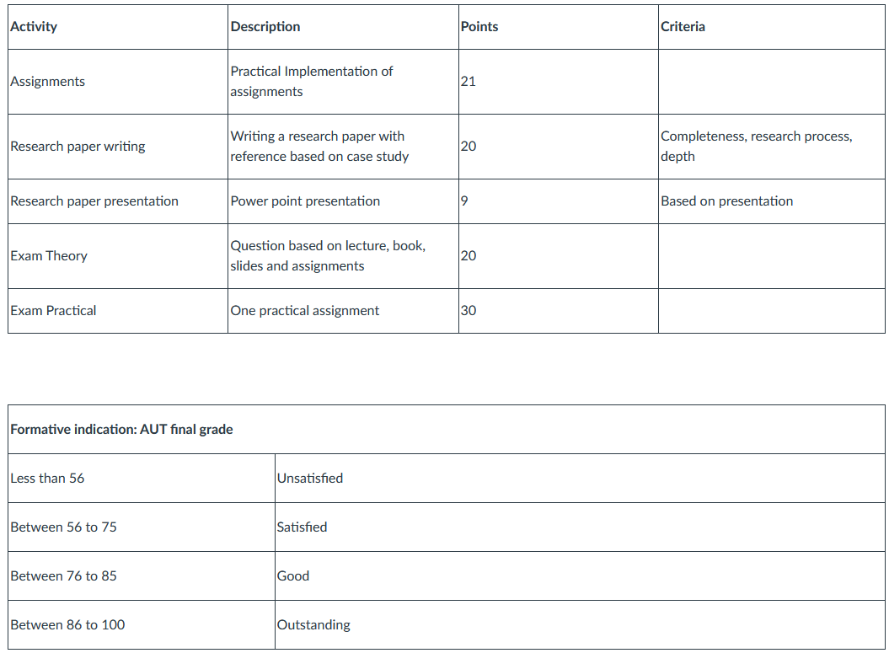

# Notes

## Week 1

Subjects:
- producer-consumer problem
- eating philosopher problem

### Processes
Every program has a PCB (Process Control Block)

State diagram of process:
TODO: add image

### Threads
They are part of a process.

Threads can share stuf, processes can't.

### Scheduling
- FCFS (First Come First Serve)
- SJF (Shortest Job First)
    - U can use heuristics to predict the time of the job (guess)
    - U can also use time slices to predict the time of the job
  
### Mutex
Use a mutex when a hsared variabe can be changed by multiple threads

Using a mutex has disadvantages:
- code becomse slower
- ...

### Semaphores
...

### Terms
- Non-atomic actions
- Mutex (mutual exclusion, one thread gets exclusive access to a shared variable)
- Thread lock
- Critical section
- Fairness