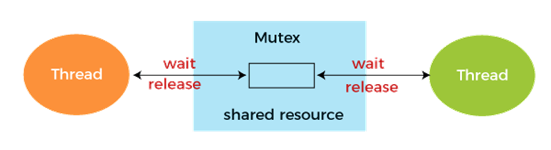
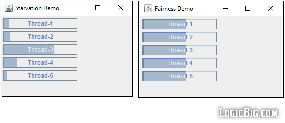
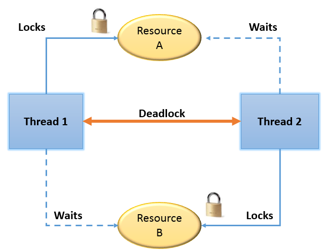

# Definitions

---

## **Mutex (Mutual Exclusion)**

**Formal Definition:**
A *mutex* (or mutual exclusion) is a synchronization mechanism used to prevent concurrent processes from accessing a shared resource at the same time. It ensures that only one thread or process can enter a critical section, where the shared resource is accessed, while others are blocked until the resource becomes available again.

**Simplified Explanation:**
A mutex is like a lock on a door that leads to a shared room (the critical section). If one person (thread) is inside, others have to wait outside until the room is empty. Only one person can use the room at a time to avoid collisions.

**Example in the Dining Philosophers Problem:**
In the Dining Philosophers problem, the philosophers need forks (shared resources) to eat. If each fork has a mutex, a philosopher must "lock" the fork before using it. This ensures that no two philosophers can use the same fork simultaneously, preventing them from clashing over resources.

---

## **Fairness**

**Formal Definition:**
*Fairness* in synchronization ensures that no process or thread is indefinitely delayed or starved of access to the critical section. It guarantees that all threads have a fair opportunity to access shared resources over time, avoiding cases where some threads are perpetually bypassed by others.

**Simplified Explanation:**
Fairness means everyone gets their turn eventually. It's like taking turns at a vending machine—no one should keep jumping ahead in line while someone else waits forever.

**Example in the Dining Philosophers Problem:**
If fairness is implemented, no philosopher will starve by endlessly waiting to pick up forks. Even if some philosophers are faster at picking up and putting down forks, the others will still get their turn to eat eventually. This avoids situations where one philosopher might starve because they can never access both forks.

---

## **Deadlocks**

**Formal Definition:**
A *deadlock* occurs when two or more processes are permanently blocked, each waiting for a resource held by another process, creating a cycle of dependencies that can never be resolved. In this state, none of the involved processes can proceed.

**Simplified Explanation:**
A deadlock is like a traffic jam at an intersection where all cars are waiting for each other to move, but no one can go because they're all blocking each other.

**Example in the Dining Philosophers Problem:**
A deadlock can occur if every philosopher picks up one fork and waits for the other fork. Since all the forks are held by someone, no philosopher can proceed, and they all get stuck waiting indefinitely—this is the deadlock condition.

